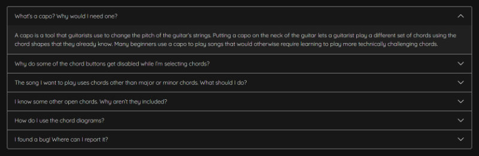

# Capo Chord Search Application

The purpose of this site is to provide a useful utility for beginner and intermediate guitarists, to help them play a wider range of songs with the most basic chord shapes that all beginner guitarists learn. 

Most guitarists start by learning the following nine basic chords, known as ‘open chords’: A, Am, C, D, Dm, E, Em, F, and G. However, there are six more major chords and nine more minor chords. To play these, guitarists have to use more complex and difficult ‘barre chords’. 

As an alternative, many guitarists use a tool called a ‘capo’, which raises the pitch of the strings depending on which fret it’s attached to. Using a capo, a guitarist can use easy open chords to play a song that would normally require challenging barre chords. For example, a song that called for a C#, an F# and a B chord could be played easily with the A, D and G chord shapes and a capo on the fourth fret.

There are eleven potential positions for a capo, each providing a unique set of transposed open chords, so it can be very time consuming for a guitarist to check each one to see if there are good options for the particular set of chords they want to play. 

This site aims to solve this problem by allowing a user to select a target set of chords and then quickly displaying any and all simplified methods of playing that set of chords using a capo.

***

## User Experience

### New User Stories

* As a new user, I want to quickly understand the purpose of the site so that I can decide if it provides value to me.
* As a new user, I want to be able to quickly understand how to use the application to meet my needs.
* As a new user, I want to intuitively understand how to access all the information and features available.
* As a new user, I want to know where to look for more information and help if I don’t understand something.

### Returning User Stories

* As a returning user, I want to be able to quickly access the features I’m interested in.

### Design

The site's overall design is quite minimalist in order to avoid distracting the user's eye from the key information presented. 

#### Colour Scheme

* The site has a 'dark mode' design, to make it easy and comfortable to read in any lighting conditions.
* Three shades of dark grey are used for section backgrounds, to provide some visual depth to the different sections while maintaining high contrast with the text.


* To help the user identify chord names and shapes, a colour is assigned to each Major chord. The colours are roughly evenly spaced across the spectrum. A similar colour in a lighter shade is assigned to each Minor chord.


* Colour is used only for chords; all other UI elements are in black, white and grey. This is intended to avoid distracting the eye and help reinforce the association between colours and chords for the user.

* The majority of the site's colours are applied using CSS root variables. This allows for quick changes to all similarly coloured site elements if required.

#### Typography

* Only two fonts are used on the site: One font for chord names and one font for all other content. This is intended to provide some visual contrast between the chord names and the rest of the content, to help them stand out.
* Most of the text on the site uses the [Quicksand](https://fonts.google.com/specimen/Quicksand) font from Google Fonts. This font was selected as it is suitable for both headings and body text and is designed to be easily readable even at smaller sizes.
* Chord names are all rendered in the [Roboto](https://fonts.google.com/specimen/Roboto) font. This font was selected as it is highly legible and the Medium weight font is used to provide a little more weight than the standard Regular weight.

#### Imagery

* The site uses png screenshots of site elements in the tutorial section, to illustrate the instructions.
* Chord diagrams are used both above the user input section and in the results section. These diagrams show users who aren't familiar with the basic chord shapes how to form those chords. The diagrams use the same colours associated with the chord they depict elsewhere on the site. SVG vector files are used for the diagrams, to keep file sizes to a minimum and allow for clean scaling to different sizes.
* Each set of results includes an illustration of a guitar neck with a thick white line to indicate the capo position for that result set. Although the required capo position is included in the text for each set of results, the illustrations provide a little extra information to the user as they show where to position the capo relative to the dot markings on the neck, without having to count the frets. SVG vector files are also used for these illustrations, to keep file sizes to a minimum and allow for clean scaling to different sizes.

### Wireframes

The site is responsively designed and will adapt to the viewing device.


Full size wireframes for each viewing device category can be viewed here:

* Mobile layout wireframe - [View](documentation/wireframes/mobile.png)
* Tablet layout wireframe - [View](documentation/wireframes/tablet.png)
* Desktop layout wireframe - [View](documentation/wireframes/desktop.png)


***

## Features

### Collapsible Welcome Section

* Users are greeted with a welcome section featuring an introduction to the application and an illustrated tutorial.
* A link is provided to the FAQ section of the site for users who require more information.
* The welcome / tutorial section can be hidden by means of the “Hide Tutorial” button at the bottom.
* When the tutorial is hidden, the text of the button changes to “Show Tutorial” and users can click this to re-open the welcome / tutorial section.
* The application uses the browser’s localStorage property to remember the last state of the tutorial section. 
* The tutorial will be hidden automatically on returning to the page if it was hidden when the user left.
* The tutorial will be visible on returning to the page if the user left it open when they last left, or if no localStorage data is found.


### Chord Diagrams

* The application features diagrams of the nine basic open chord shapes both above the input section and in search results.
* These diagrams serve as a reminder for beginner guitarists and make the application easier to use and understand.
* The diagrams are rendered using the svg vector format. This format is supported by all major modern browsers and offers the benefits of small file size and scalability to different sizes without loss of quality.
* The diagrams use the same colours for the fingering positions as are used in the corresponding chord buttons elsewhere in the application.
* Although it's assumed that users will be guitarists who understand how to read chord diagrams, an explanation is provided in the FAQs section.


### Chord Selection Buttons

* Users can select their target chords using an array of colour coded buttons.
* Each button has a unique colour and each colour is consistently used everywhere that the corresponding chord is referenced.
* The button layout changes responsively depending on the viewing device.
* The buttons respond to user input by filling with colour when selected and reverting to a coloured outline when deselected.
* As chords are selected, buttons which correspond to chords which cannot be combined with already selected chords are disabled.
* A tooltip appears when the user hovers over a disabled button for a short time or attempts to tap a disabled button on mobile, to inform them why that button is unavailable. 


### Search Results Area

* All matching results are automatically added to a search results area as the user clicks on the chord selection buttons.
* At the top of the search results area is a notice telling the user how many capo positions match their selected chords. 
* Each individual search result consists of a heading telling the user where to place their capo (along with a supporting illustration of the guitar neck) and a series of boxes detailing which open chord shape to use to play each requested chord at that capo position.
* The capo position heading for each section is enclosed in an h3 tag to aid navigation of this section by screen readers and other accessibility tools.
* The layout of the search results respond to the viewing device.


### FAQ Accordion

* An accordion of frequently asked questions and answers is included at the bottom of the page.
* Users can click on any question to show or hide the answer.



### Footer Bar

* A simple footer is included with a link to the developer’s github page, where users can report any issues.


***

## Technologies

### Languages Used

* [HTML5](https://en.wikipedia.org/wiki/HTML5)
* [CSS3](https://en.wikipedia.org/wiki/CSS)
* [Javascript](https://en.m.wikipedia.org/wiki/JavaScript)

### Frameworks, Libraries & Programs Used

1. [GitHub](https://github.com/) - Used for version control and deployment through GitHub Pages.
2. [GitPod](https://gitpod.io/) - Used to write all code and test before deploying to GitHub.
3. [Balsamiq](https://balsamiq.com/) - Used to produce design wireframes.
4. [Bootstrap](https://getbootstrap.com/) - Version 5.1.3 used extensively through the site to assist with layout and basic styling. In particular, the responsive grid, tutorial section cards, basic button styles, FAQ section accordion and various layout utility classes. The [Bootstrap 5.1 documentation](https://getbootstrap.com/docs/5.1/getting-started/introduction/) was used for reference.
5. [jQuery](https://jquery.com/) - Used extensively in caposearch.js. In particular, jQuery selectors, DOM manipulation tools and some animations were used.
6. [Affinity Designer](https://affinity.serif.com/en-gb/designer/) - Used to draw SVG vector illustrations of chord shapes and capo positions. 
7. [Affinity Photo](https://affinity.serif.com/en-gb/photo/) - Used to combine and crop screenshots and illustrations for project documentation and the tutorial section.
8. [Google Fonts](https://fonts.google.com) - [Quicksand](https://fonts.google.com/specimen/Quicksand) font and [Roboto](https://fonts.google.com/specimen/Roboto) font used throughout the site.
9. [Jest](https://jestjs.io/) - Used to test javascript code.
10. [Firefox](https://www.mozilla.org/en-GB/firefox/new/) - Firefox browser dev tools used to test code and check accessibility.
11. [W3C.org](https://www.w3.org/) - W3C [HTML Validator](https://validator.w3.org/nu/) and [CSS Validator](https://jigsaw.w3.org/css-validator/validator) used to check HTML and CSS code for errors.
12. [JSHint](https://jshint.com/) - Used to check javascript for errors.
13. [Palette Generator](https://planetcalc.com/5799/) - Used to generate an even spread of colours for the chord colours.

***

## Testing

Please see [TESTING.md](TESTING.md) for details of tests performed and bugs fixed.

***

## Deployment

### Deploying to GitHub Pages

The site was deployed to GitHub Pages using the following process:

1. Log in to GitHub.
2. Click the "Repositories" link at the top of the GitHub user dashboard.
3. Locate the [GitHub project repository](https://github.com/lmjh/capo-search-app) and click its title.
4. On the project page, click the "Settings" link in the options menu at the top of the page.
5. Click the "Pages" link near the bottom of the menu on the Settings page.
6. On the GitHub Pages settings menu, click the dropdown beneath "Source" and select "main".
7. Check that the new dropdown that appears displays "/ (root)" and then click "Save".
8. A confirmation message should appear with a link to the deployed site. Click this link to view the site. (It may take a minute or two for the site to be available.)

### Forking the GitHub Repository

By forking the GitHub Repository we make a copy of the original repository on our GitHub account to view and/or make changes without affecting the original repository by using the following steps...

1. Log in to GitHub and locate the [GitHub Repository](https://github.com/lmjh/capo-search-app)
2. At the top of the Repository (not top of page) just above the "Settings" Button on the menu, locate the "Fork" Button.
3. You should now have a copy of the original repository in your GitHub account.

### Making a Local Clone

1. Log in to GitHub and locate the [GitHub Repository](https://github.com/lmjh/capo-search-app)
2. Under the repository name, click "Clone or download".
3. To clone the repository using HTTPS, under "Clone with HTTPS", copy the link.
4. Open Git Bash
5. Change the current working directory to the location where you want the cloned directory to be made.
6. Type `git clone`, and then paste the URL you copied in Step 3.

```
$ git clone https://github.com/lmjh/capo-search-app.git
```

7. Press Enter. Your local clone will be created.

```
$ git clone https://github.com/lmjh/capo-search-app.git
> Cloning into `CI-Clone`...
> remote: Counting objects: 10, done.
> remote: Compressing objects: 100% (8/8), done.
> remove: Total 10 (delta 1), reused 10 (delta 1)
> Unpacking objects: 100% (10/10), done.
```

Click [Here](https://help.github.com/en/github/creating-cloning-and-archiving-repositories/cloning-a-repository#cloning-a-repository-to-github-desktop) to retrieve pictures for some of the buttons and more detailed explanations of the above process.

Alternatively, if using Gitpod, you can click below to create your own workspace using this repository.

[](https://gitpod.io/#https://github.com/lmjh/capo-search-app)

***

## Other Credits and Acknowledgements

* My Code Institute mentor, [Tim Nelson](https://tim.2bn.dev/), for his very helpful advice and feedback throughout the project.
* [Code Institute](https://codeinstitute.net/) for their helpful lessons and reference materials.
* [Code Institute Sample README](https://github.com/Code-Institute-Solutions/SampleREADME/blob/master/README.md) for the structure of this project's documentation and the GitHub forking and cloning processes.