# Testing of Capo Search App
## Code Validation

All site code was validated using the following services:

* HTML code validated with W3C [HTML Validator](https://validator.w3.org/nu/).

* CSS code validated with W3C [CSS Validator](https://jigsaw.w3.org/css-validator/).

* Javascript and Jest test specifications code validated with [JSHint](https://jshint.com/).

### HTML Validation

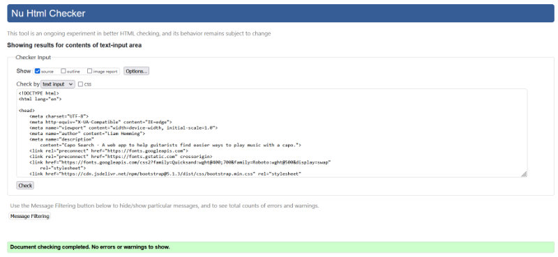

HTML validation passed with no errors or warnings.

### CSS Validation

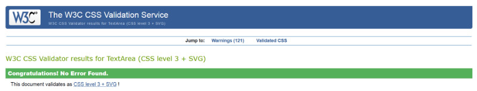

CSS validation passed with no errors. The validator returned 121 warnings. However, all of these warnings were repetitions of a warning that the border colour and background colour were the same in the various chord control button styles. This is an intentional design choice, so I don't consider these warnings to be an issue.


### Javascript Validation

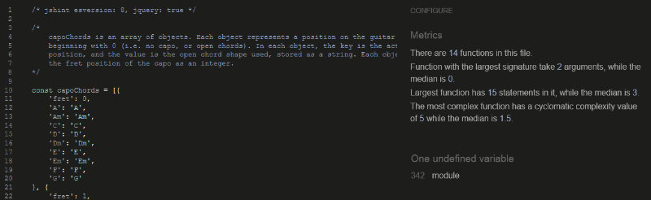

Javascript validation of the application code in caposearch.js passed with one warning, that the 'module' variable is undefined. 'Module' is used to export the functions in this file to the testing file and is a necessary part of the code. This code will also not be run by the browser (see Noteworthy Bugs Discovered #3), so I don't consider this warning to be an issue.


Javascript valdation of the Jest test specification file caposearch.test.js passed with two warnings. 

The first warning, "Redefinition of '$'", refers to the code that had to be added to allow Jest to work correctly with jQuery (see Jest Configuration below). 

The second warning, "document.write can be a form of eval", refers to the use of the document.write method in the bolierplate code starting at line 30, which is used to set up the test environment DOM. The warning occurs because using the document.write method is generally considered bad practice. In this context, though, using this method should not be a problem.

***

## Javascript Testing With Jest

All of the application's Javascript functions and objects have been tested using Jest. The tests were written after the application was largely complete and functional, rather than written alongside the application code as in a Test Driven Development process. I chose to use this approach as this was the first significant Javascript project I'd worked on and it seemed impractical to learn to write Jest tests alongside learning to write the application code.

### Jest Configuration

Testing the application with Jest proved to be somewhat difficult due to the jQuery used, which Jest is not equipped to handle by default. After a good deal of research, I managed to configure the test suite to handle jQuery with the following steps:

1. Use the node package manager to install jquery using the following command:
```
npm install jquery
```
2. Include the following code at the top of the test specification file (based on solutions to similar issues discussed in threads [here](https://stackoverflow.com/questions/38309405/how-can-i-fix-referenceerror-is-not-defined-when-using-jquery-with-mocha-js) and [here](https://stackoverflow.com/questions/41844947/reactjs-jest-jquery-is-not-defined), among others): 
```
const $ = require('jquery');
global.$ = global.jQuery = $;
```
3. Include the following code in the test specification file to disable (and then re-enable) jQuery animations that were causing tests to fail (based on the solution in [this thread](https://stackoverflow.com/questions/53732869/testing-jquery-animations-with-jest)):
```
beforeAll(() => {
    $.fx.off = true;
})
afterAll(() => {
    $.fx.off = false;
})
```

It was also necessary to setup Jest to work with Bootstrap functions, as I used Bootstrap tooltips in the application. I wasn't able to import the neessary Javascript files into Jest from a CDN as I normally would, as the test suite seemed unable to access external files, so I downloaded a copy of the Bootstrap Javascript bundle and stored it locally in a subdirectory of the test specification directory. The following code was then added to the test specification file to add bootstrap functions to Jest:

```
require('./bootstrap/bootstrap.bundle.min.js');
```

### Jest Tests
  
* The test specifications file is: [caposearch.test.js](https://github.com/lmjh/capo-search-app/blob/ef2fbcf9addaa9fe3eaa25df804b7f64737b32b8/assets/js/tests/caposearch.test.js)
* The javascript file being tested is: [caposearch.js](https://github.com/lmjh/capo-search-app/blob/ef2fbcf9addaa9fe3eaa25df804b7f64737b32b8/assets/js/caposearch.js)

The test specification contains a total of 34 automated Jest tests and all pass as expected. 

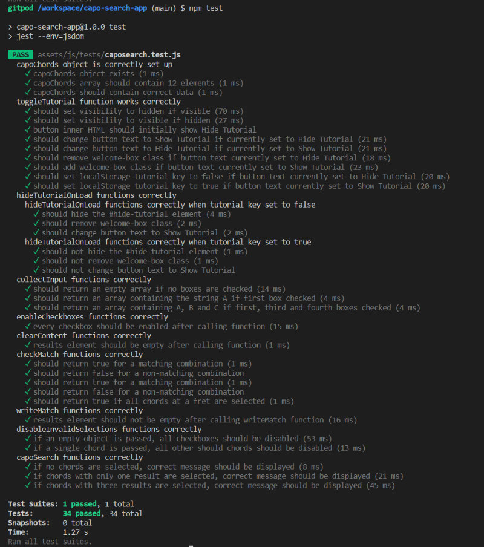

The tests in place cover every function and the one object included in the application's Javascript file. I have tried to test an example of every expected behaviour of each function, with a few notable exceptions:

* The writeMatch function, which is responsible for writing matched chord positions to the results area of the DOM, has not been fully tested with Jest as its outputs are long and complex strings of HTML code, which would be difficult and time consuming to automatically test with Jest. I therefore used extensive manual testing to confirm that this function was correctly writing results to the DOM.
* Some parts of the capoChords function, which controls the overall flow of the application, have not been fully tested with Jest. This function is difficult to test with automated tests as it is somewhat complex and most of its functionality involves calling other functions (which have been tested individually with Jest) and passing values between functions. capoSearch's more isolatable behaviours, like its response to a zero-length input string and writing the number of results found to the DOM, have been tested with Jest, while the remaining functionality was tested manually.
* I have not tested all Jquery or Bootstrap functions with Jest. In some instances where Jquery and Bootstrap functions are called, I have confirmed through manual testing that they are behaving as expected. This is because I don't consider testing these libraries to be within the scope of this project.

### How to run Jest tests 

After cloning the project, follow the instructions on [this page](https://jestjs.io/docs/getting-started) to install Jest to your development environment. Next, follow the steps in the Jest Configuration section above to setup Jest to  work with Jquery and Bootstrap functions. Once that's done, run Jest from the command line and the program should automatically detect and process the test file.

***

## User Stories Testing

### New User Stories

1. As a new user, I want to quickly understand the purpose of the site so that I can decide if it provides value to me.

    * All new visitors are greeted by a Welcome / Tutorial box, at the top of which is a section titled "What is Capo Search?".
    * This section includes a brief, two sentence overview of what the application does and what value it offers.
    * If a new user still has questions, a link is provided to take them directly to the FAQ section, where more information can be found.

    

2. As a new user, I want to be able to quickly understand how to use the application to meet my needs.

    * All new visitors are greeted by a Welcome / Tutorial box, the second section of which is titled "How do I use Capo Search?".
    * This section features a short, illustrated tutorial that explains how to use the application's controls to find information, and then how to interpret that information.

    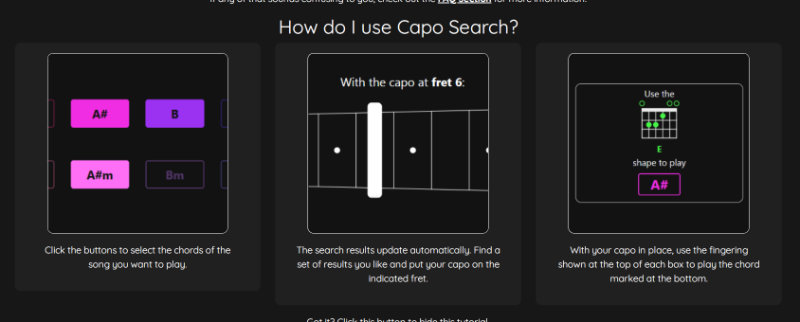

3. As a new user, I want to intuitively understand how to access all the information and features available.

    * The application uses buttons with a design form that should be familiar to most users.
    * Visual feedback is provided where possible. Hovering over a button highlights it to indicate interactivity and clicking a button changes it to a filled state to indicate that it is selected. 
    * Tooltips are applied to buttons which are disabled, to ensure that users understand why those buttons are unavailable. 
    
    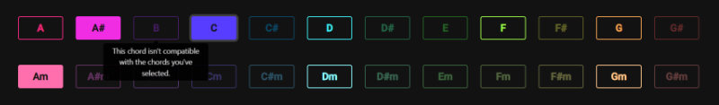

    * Search results combine written explanations with supporting illustrations to make it as easy as possible to understand and use them.

    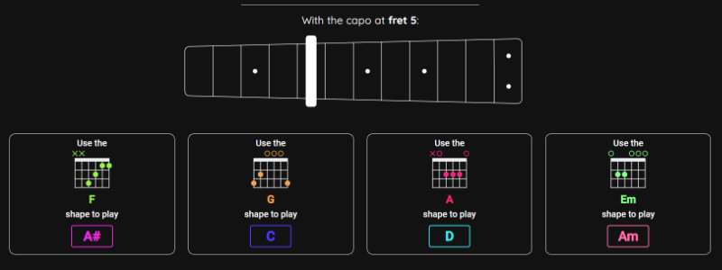

    * The first entry of the FAQ accordion starts in an open state, as a visual hint that the other questions can be clicked to open them and find information.
    
    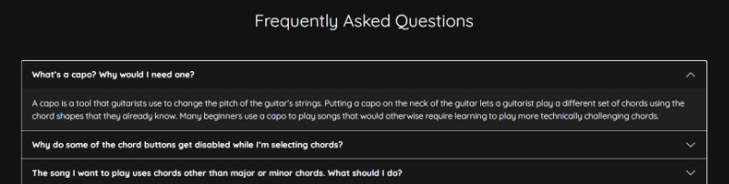

4. As a new user, I want to know where to look for more information and help if I don’t understand something.
    * A prominent link to the FAQ section is provided at the top of the page, which all users should see on page load.
    * The FAQ section is directly under the search results, so simply scrolling down past the controls and results will lead users to further information.

### Returning User Stories

1. As a returning user, I want to be able to quickly access the features I’m interested in.
    * The site is designed to be compact, keeping unneccessary information and page elements to a minimum, so users can access the key features as quickly and easily as possible.
    * A "Hide Tutorial" button is provided so that once users are familiar with the application, they needn't scroll past the tutorial content to access the controls.

    
    * The application uses local storage to record when a user hides or shows the tutorial and the tutorial is either hidden or displayed accordingly when the user next loads the page. This allows returning users to get straight to the application controls every time they visit.
    
    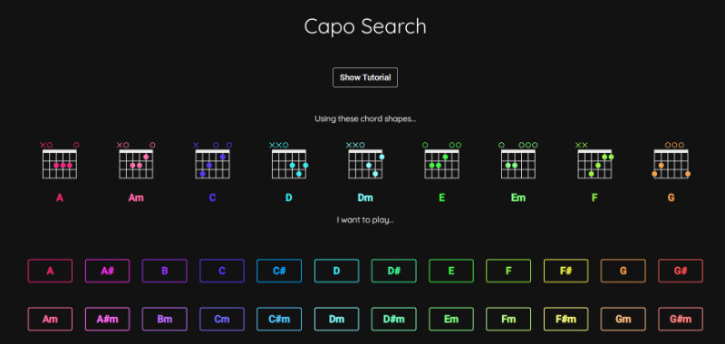

***

## Further Testing

The application has been manually tested extensively in Firefox, Chrome and Microsoft Edge on a desktop computer and Chrome and Firefox on an Android mobile and tablet. Various different mobile layouts have also been tested using Firefox developer tools.

Among other tests, the following steps were taken on each device and browser:

### Links
* Click all links on page and ensure they are working correctly.

### Welcome Section
* Check layout and styling is applied correctly and images render properly.
* Click Hide Tutorial and Show Tutorial and check tutorial box is hiding/showing correctly.
* Click Hide / Show Tutrial as quickly as possible.
* Refresh the page while Tutorial is hidden/visible. Ensure the state remains the same on reload.

### User Input Section
* Check layout and styling is applied correctly and images render properly.
* Select and deselect each button in turn. Ensure the button works correctly and the value is passed into the results section.
* Click buttons in combination. Ensure values are all passed into results section.
* Try to click disabled buttons. Check that the button doesn't function and that tooltip appears.
* Try to click many buttons quickly. Check that it isn't possible to select invalid combinations or cause other issues.

### Search Results Section
* Check layout and styling is applied correctly and images render properly for a range of different chord selections.
* Check message / number of matches at top of results updates correctly.
* Check correct matches are displayed.

### FAQ Section
* Check layout and styling is applied correctly.
* Click each accordion section title to check it opens and closes correctly.
* Open different combinations of accordion sections to check no display issues occur.

***

## Noteworthy Bugs Discovered

### 1. Refreshing page left chords selected with no results showing
* If a user clicked one or more buttons and then refreshed the page on Firefox, the buttons would remain selected but no results would be shown, resulting in a confusing experience. Buttons are automatically deselected in some other browsers, so this issue didn't occur.

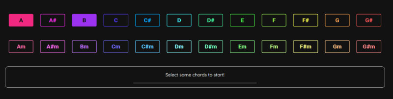

* This was resolved by adding a call to the capoChords function in the document ready function. This means that the application checks for any selected buttons and displays appropriate results on page load.

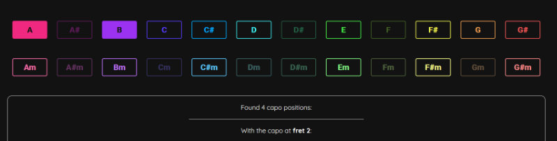

* I considered simply deselecting all checkboxes on page load as an alternative fix, but decided that this would result in a poorer user experience, as users of browsers where checkboxes not automatically deseleted on page reload may prefer that functionality.

### 2. Tutorial box styling remained after hiding tutorial content
* When the user clicked the button to hide the tutorial content, the outline box remained in place, which resulted in a messy layout.


* This was resolved by adding code to the toggleTutorial function that toggled the "welcome-box" class from the relevant HTML element when the tutorial content was hidden or shown.


### 3. Browser console error caused by Jest export
* Jest testing requires exporting the functions and objects to be tested from the javascript file into the Jest test specification file using the module.exports method. While this works in the development environment where the tests are run, the inclusion of the code causes an error in the browser because "module" is not defined in that environment.

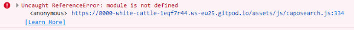

* This issue was resolved by adding an if statement that prevents the code from being run if 'module' is undefined, based on the solution in [this thread](https://stackoverflow.com/a/68671391).
```
if (typeof module !== "undefined") module.exports = { };
```

### 4. Jerky animation when hiding or showing tutorial section content
* The Hide/Show Tutorial toggle used a jQuery animation to smoothly transition between hidden and visible states, but the animation was jerky and uneven.

* This issue was resolved by simply replacing the jQuery toggle() function with slideToggle(), which produces a much smoother transition animation.

### 5. Number of search results message incorrectly pluralised
* The message informing the user of the number of search results would incorrectly use the plural "positions" when only one position was found.
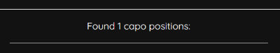

* This was resolved by adding a ternary conditional operator to check if the number of positions is greater than 1 and add an 's' to the word 'position' if so.
```
<p>Found ${positionCount} capo position${(positionCount > 1) ? "s" : ""}:</p>
```


***

## Outstanding Issues

### Internet Explorer Not Supported

The website will not display or function correctly on Internet Explorer browsers. This is mainly because Internet Explorer does not support the root variables used to apply CSS colours and also does not support Javascript ES6 or later. I don't consider adding support for Internet Explorer to be a priority, as the browser is currently not widely used, is no longer updated, and is due to be retired in 2022.