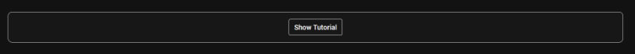

# Testing of Capo Search App
## Code Validation

All site code was validated using the following services:

* HTML code validated with W3C [HTML Validator](https://validator.w3.org/nu/).

* CSS code validated with W3C [CSS Validator](https://jigsaw.w3.org/css-validator/).

* Javascript code validated with [JSHint](https://jshint.com/).

## Javascript Testing With Jest

The majority of the application's functions have been tested using Jest. Testing the application with Jest proved to be somewhat difficult due to the jQuery used, which Jest is not equipped to handle by default. After a good deal of research, I managed to configure the test suite to handle jQuery with the following steps:

1. Use the node package manager to install jquery using the following command:
```
npm install jquery
```
2. Include the following code at the top of the test specification file (based on solutions to similar issues discussed in threads [here](https://stackoverflow.com/questions/38309405/how-can-i-fix-referenceerror-is-not-defined-when-using-jquery-with-mocha-js) and [here](https://stackoverflow.com/questions/41844947/reactjs-jest-jquery-is-not-defined), among others): 
```
const $ = require('jquery');
global.$ = global.jQuery = $;
```
3. Include the following code in the test specification file to disable (and then re-enable) jQuery animations that were causing tests to fail (based on the solution in [this thread](https://stackoverflow.com/questions/53732869/testing-jquery-animations-with-jest)):
```
beforeAll(() => {
    $.fx.off = true;
})
afterAll(() => {
    $.fx.off = false;
})
```

* The test specifications file is: [caposearch.test.js](https://github.com/lmjh/capo-search-app/blob/ef2fbcf9addaa9fe3eaa25df804b7f64737b32b8/assets/js/tests/caposearch.test.js)
* The javascript file being tested is: [caposearch.js](https://github.com/lmjh/capo-search-app/blob/ef2fbcf9addaa9fe3eaa25df804b7f64737b32b8/assets/js/caposearch.js)

### How to run Jest tests 

After cloning the project, follow the instructions on [this page](https://jestjs.io/docs/getting-started) to install Jest to your development environment. Once that's done, run Jest from the command line and the program should automatically detect and process the test file.

## User Stories Testing

## Further Testing

## Noteworthy Bugs Discovered

1. Refreshing page left chords selected with no results showing
* If a user clicked one or more buttons and then refreshed the page, the buttons would remain selected but no results would be shown, resulting in a confusing experience.


* This was resolved by adding a call to the capoChords function in the document ready function. This means that the application checks for any selected buttons and displays appropriate results on page load.


* I considered simply deselecting all checkboxes on page load as an alternative fix, but decided that this would result in a poorer user experience, as users would lose their selected chords whenever they refreshed the page.

2. Tutorial box styling remained after hiding tutorial content
* When the user clicked the button to hide the tutorial content, the outline box remained in place, which resulted in a messy layout.



* This was resolved by adding code to the toggleTutorial function that toggled the "welcome-box" class from the relevant HTML element when the tutorial content was hidden or shown.


3. Browser console error caused by Jest export
* Jest testing requires exporting the functions and objects to be tested from the javascript file into the Jest test specification file using the module.exports method. While this works in the development environment where the tests are run, the inclusion of the code causes an error in the browser because "module" is not defined in that environment.


* This issue was resolved by adding an if statement that prevents the code from being run if 'module' is undefined, based on the solution in [this thread](https://stackoverflow.com/a/68671391).
```
if (typeof module !== "undefined") module.exports = { };
```

4. Jerky animation when hiding or showing tutorial section content
* The Hide/Show Tutorial toggle used a jQuery animation to smoothly transition between hidden and visible states, but the animation was jerky and uneven.

* This issue was resolved by simply replacing the jQuery toggle() function with slideToggle(), which produces in a much smoother transition animation.

## Outstanding Issues